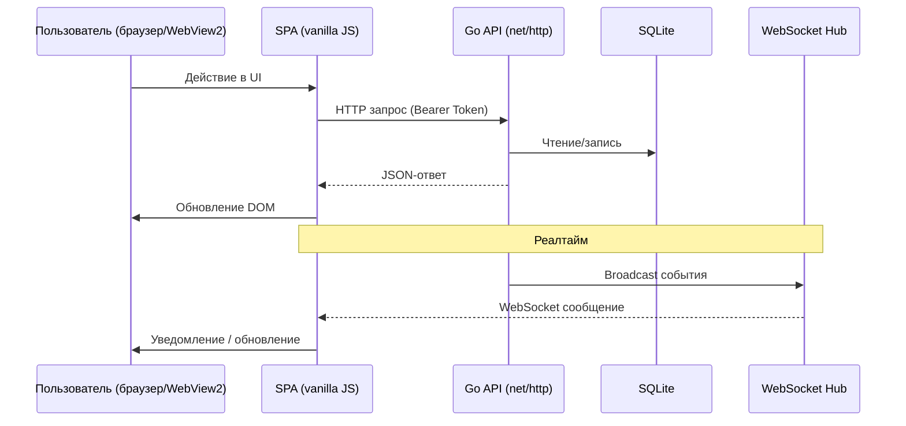
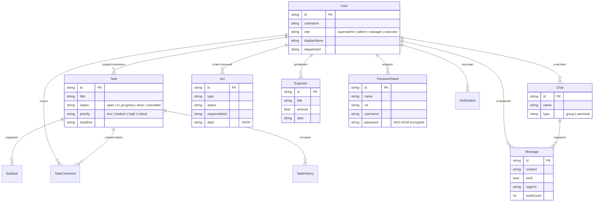

# Архитектура проекта

⚠️ **Внимание: NDA (Соглашение о неразглашении)**

Данный репозиторий является портфолио-визиткой. Исходный код проекта является закрытым в связи с коммерческой тайной работодателя. В этом описании представлена архитектура проекта, используемый стек технологий, а также скриншоты пользовательского интерфейса (с использованием тестовых и обезличенных данных) исключительно для демонстрации моих компетенций как инженера-разработчика.

---

## Общая архитектура

```text
┌─────────────────────────────────────────────────────┐
│                    Браузер / WebView2               │
│  ┌───────────────────────────────────────────────┐  │
│  │             SPA (Vanilla JS)                  │  │
│  │  api.js ←→ app-core.js ←→ app-modules.js      │  │
│  │         ↕                   ↕                 │  │
│  │    app-tasks.js    app-profile-sync.js        │  │
│  │    app-timetracking.js                        │  │
│  └──────────┬───────────────────┬───────────────┘  │
│             │ HTTP (fetch)      │ WS               │
└──────────────┼───────────────────┼─────────────────┘
               │                   │
┌──────────────┼───────────────────┼─────────────────┐
│  Go-сервер   │                   │                  │
│              ▼                   ▼                  │
│  ┌─────────────────────────────────────────────┐   │
│  │           Middleware (CORS + Auth)          │   │
│  └──────────────────┬──────────────────────────┘   │
│                     │                              │
│  ┌──────────────────▼──────────────────────────┐   │
│  │               Mux (net/http)                │   │
│  │  /api/login  /api/tasks  /api/chats  ...    │   │
│  └──┬────────┬────────┬─────────┬─────────────┘   │
│     │        │        │         │                  │
│     ▼        ▼        ▼         ▼                  │
│  ┌────┐ ┌────────┐ ┌──────┐ ┌────────┐            │
│  │Auth│ │Хендлеры│ │ WS   │ │Внешние │            │
│  │    │ │        │ │ Hub  │ │сервисы │            │
│  └────┘ └───┬────┘ └──┬───┘ └────────┘            │
│             │         │         │                  │
│             ▼         │         │                  │
│  ┌────────────────┐   │         │                  │
│  │    SQLite      │   │    ┌────▼──────┐           │
│  │   (corp.db)    │   │    │ PostgreSQL │           │
│  └────────────────┘   │    │(статистика)│           │
│                       │    └───────────┘           │
│  ┌────────────────┐   │    ┌───────────┐           │
│  │  Файловая      │   │    │ Telegram  │           │
│  │  система       │   │    │ Bot API   │           │
│  │ uploads/       │   │    └───────────┘           │
│  │ templates/     │   │    ┌───────────┐           │
│  │ acts/          │   │    │ Giphy API │           │
│  └────────────────┘   │    │ (GIF)     │           │
│                        │    └───────────┘           │
│  ┌────────────────┐    │                           │
│  │ Vault Crypto   │    │                           │
│  │ AES-256-GCM    │    │                           │
│  └────────────────┘    │                           │
└────────────────────────┼───────────────────────────┘
                         │
              ┌──────────▼──────────┐
              │      Caddy          │
              │ (опционально)       │
              │ reverse-proxy       │
              │ TLS (HTTPS)         │
              └─────────────────────┘
```

Go-монолит: один бинарник включает весь бэкенд и статику фронтенда (`//go:embed all:frontend`).

Компаньон — отдельное Wails-приложение (WebView2), которое обращается к локальному серверу.

## Поток данных



## Компоненты бэкенда

```text
Корень проекта:
├── main.go                 # Точка входа, //go:embed all:frontend

internal/server/
├── bootstrap.go            # Инициализация: папки, БД, шаблоны
├── database.go             # SQLite: миграции, addColumnIfNotExists
├── session.go              # Сессии (sync.Map, token → userID)
├── security.go             # Сессии, настройки CORS
├── middleware.go           # Сессионная аутентификация, CORS, noCache
├── ratelimit.go            # Rate limiter (5 попыток / 10 мин)
│
├── mux.go                  # Роутинг /api/*
├── handlers.go             # Хендлеры: задачи, файлы, экспорт
├── handlers_auth.go        # Логин, регистрация, профиль
├── handlers_admin.go       # Управление пользователями, Telegram
├── handlers_tasks.go       # Задачи, подзадачи, комментарии
├── handlers_chats.go       # Чаты, сообщения
├── handlers_misc.go        # Уведомления, бэкапы, синхронизация
├── handlers_vault.go       # Хранилище паролей
├── handlers_export.go      # Excel экспорт
├── handlers_import.go      # Excel импорт
├── handlers_giphy.go       # GIF-прокси (Giphy API)
├── handlers_pg_stats.go    # Статистика (PostgreSQL + SQLite)
│
├── websocket.go            # WS Hub: рассылка, комнаты
├── acts_watcher.go         # FS watcher для DOCX-актов
├── vault_crypto.go         # AES-256-GCM шифрование
├── backup.go               # VACUUM INTO + SHA256
├── superadmin.go           # Seed суперадминистратора
├── telegram.go             # Telegram Bot интеграция
│
├── lan.go                  # HTTP-сервер, статика, LAN
├── folders.go              # Структура папок данных
├── paths.go                # Утилиты путей
├── files_open.go           # Открытие файлов в ОС
├── utils.go                # Утилиты
├── import_excel.go         # Парсинг Excel
├── efficiency_templates.go # Шаблоны эффективности
│
├── models.go               # Все структуры данных
└── data/                   # Встроенные данные
```

## Компоненты фронтенда

```text
frontend/
├── index.html              # SPA-корень (?v=N cache-busting)
├── logo.png / logo.svg     # Иконки
├── css/style.css           # Тёмная тема (CSS custom properties)
│
└── js/
    ├── api.js              # HTTP-клиент: fetch + Bearer token
    ├── app-core.js         # Инициализация, меню, роутинг, layout
    ├── app-tasks.js        # Задачи: Kanban, Gantt, чат задач
    ├── app-modules.js      # Расходы, Vault, админка, отчёты
    ├── app-timetracking.js # Трекер времени: таймер, отчёты
    └── app-profile-sync.js # Профиль, акты, синхронизация
```

Фронтенд — SPA без фреймворков. DOM через `innerHTML`, события через глобальные функции. Стилизация через CSS custom properties.

## Базы данных

### SQLite (`corp.db`) — основная

Хранит всё: пользователи, задачи, чаты, сообщения, расходы, акты, сотрудников, хранилище паролей, логи синхронизации.

- Путь по умолчанию: `%APPDATA%\CorpApp\data\corp.db`
- Portable: `./data/corp.db` рядом с бинарником
- Soft-delete для пользователей, задач, чатов и сообщений (`deleted_at IS NULL`)
- Hard-delete для остальных сущностей
- Миграции императивные, через `addColumnIfNotExists()`

### PostgreSQL — статистика (опционально)

Дублирует статистику актов для внешнего приложения (defect-app). Фолбэк на SQLite при недоступности.

## Безопасность

| Механизм | Описание |
|----------|----------|
| **Сессии** | Opaque Bearer-токен в Authorization header, хранение сессий в памяти (`sync.Map`) |
| **WebSocket auth** | Токен первым сообщением после Upgrade (не в query string) |
| **Password hashing** | bcrypt через `golang.org/x/crypto` |
| **Vault** | AES-256-GCM, ключ из пароля через PBKDF2 |
| **CORS** | Белый список (localhost, частные IP) |
| **Rate limiter** | 5 попыток логина за 10 мин, блокировка 30 мин |
| **XSS protection** | `escapeHtml()` экранирует `&`, `<`, `>`, `"` |
| **Backup integrity** | SHA256 checksum после VACUUM INTO |
| **Portable data** | Изоляция данных в отдельной папке |

## Модели данных (ключевые сущности)



## Деплой

Бинарник запускается как Windows Service (NSSM) с авто-восстановлением. Опционально за reverse-proxy (Caddy) для HTTPS и доступа извне.

```bat
build.bat            # go build -o build/bin/corp-app.exe .
start.bat            # запуск
```

Сервер поднимает HTTP на `LISTEN_ADDR` (по умолчанию `127.0.0.1:8765`), доступен в браузере и через WebView2-клиент.
